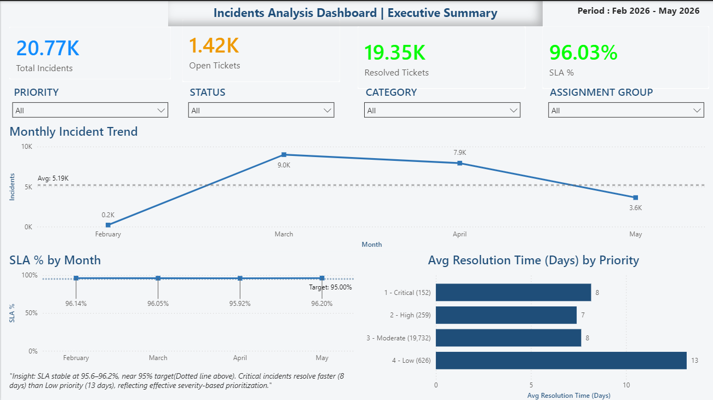
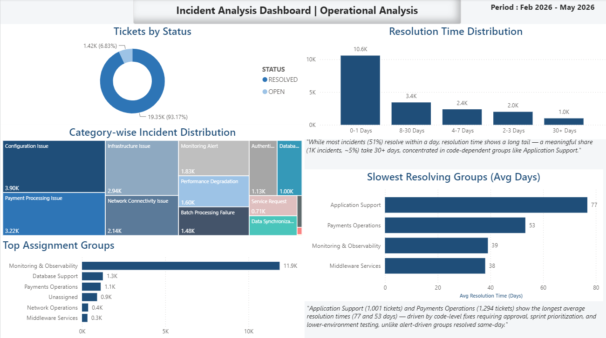

# Incident Management Dashboard

## Project Overview

This Power BI dashboard was developed to analyze incident management performance, SLA compliance, operational efficiency, and service reliability across IT support operations.

The solution provides a centralized view of incident trends, resolution performance, severity distribution, and SLA adherence, enabling stakeholders to identify operational bottlenecks and improve service delivery.

---

## Business Problem

IT operations teams handle large volumes of incidents daily. Without proper monitoring, organizations may experience:

* Increased SLA breaches
* Delayed incident resolution
* Poor service quality
* Limited visibility into operational performance

This dashboard helps management monitor service KPIs, track incident trends, and identify areas requiring corrective action.

---

## Tools & Technologies

* Power BI Desktop
* Power Query
* DAX
* Data Modeling
* Interactive Visualizations

---

## Key Performance Indicators

* Total Incidents
* Open Incidents
* Closed Incidents
* SLA Compliance %
* Average Resolution Time
* Incident Severity Distribution
* Incident Resolution Trends
* Operational Performance Metrics

---

## Dashboard Features

### Executive Overview

Provides a high-level summary of incident management performance through KPI cards, SLA metrics, and incident trend analysis.

### Operational Analysis

Analyzes incident severity distribution, resolution performance, SLA adherence, and operational efficiency.

### Interactive Filtering

Supports dynamic exploration using slicers, drill-down capabilities, and cross-filtering interactions.

### KPI Monitoring

Tracks key operational metrics and highlights performance trends.

---

## Business Insights

* Monitor SLA compliance across incident categories.
* Identify operational bottlenecks affecting incident resolution.
* Analyze incident severity distribution and workload patterns.
* Track resolution trends and service performance.
* Support data-driven operational decision-making.

---

## Dashboard Screenshots

### Executive Overview

### Operational Analysis

---

## Project Outcome

The dashboard provides operational teams and management with a comprehensive view of incident performance, helping improve service quality, reduce SLA breaches, and enhance incident resolution efficiency.
